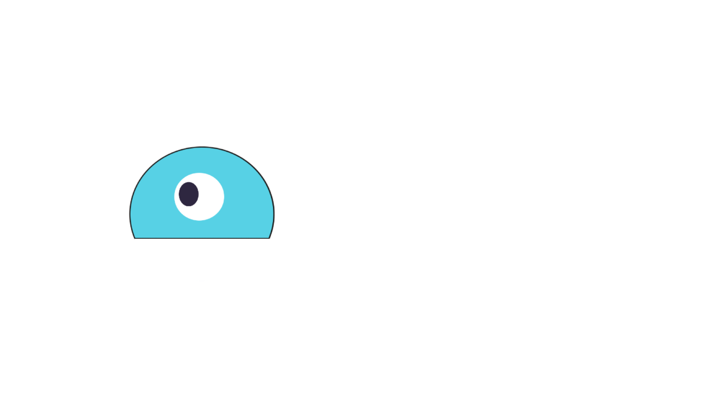
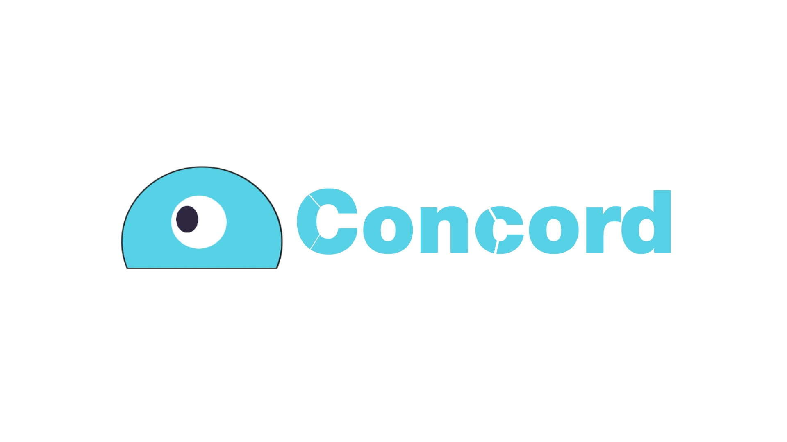
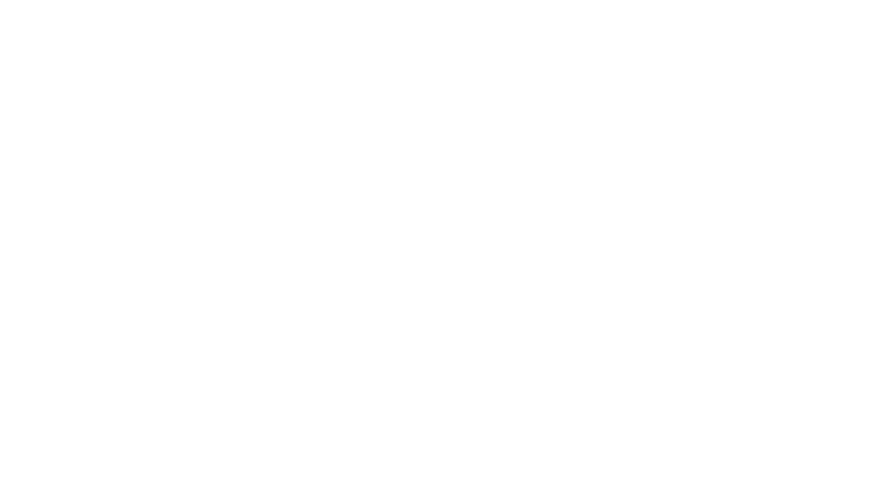
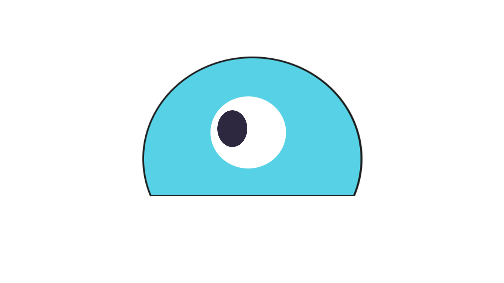

# Brand
The Concord brand is manufactured to look sleek and minimalistic,
We're keen on keeping thing's to quality and to code,
so if you do end up using the Concord brand somewhere please send it our way for approval.

# Word Mark
The word mark should be the logo shown on banners, embeds, thumbnails and anything related.

  
   
  

# Mascot
Our mascot is the main part of our 
brand--it removes the need for words on a PFP on social media sites and essentially everywhere else.

  

# Fonts
Currently, all of our wordmarks use Helvetica Neue 95 Black.

# Distortion/Modifcation
Please do not edit, change, distort, recolor, or reconfigure the Concord Logo(s).

# Colors

Concord Blue: #57D1E5 | 56, 8, 0, 10

Blurple: #7289DA | 56, 43, 0, 0

<spam style="color:#2D2D2D">NitroDB Black

Might not be visible on some themes

White: #FFFFFF | 0, 0, 0, 0

Might not be visible on some themes
