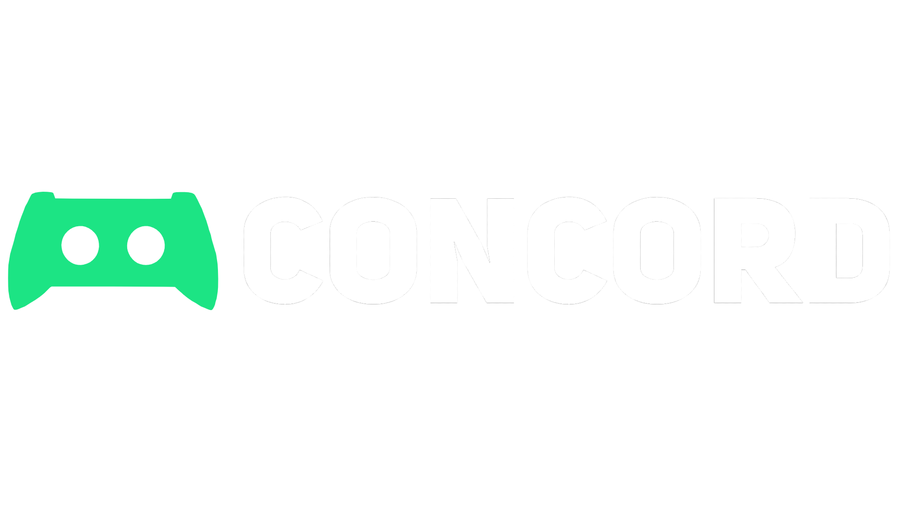

# Brand
The Redux brand is manufactured to look sleek and minimalistic,

We're also keen on keeping things quality.
If you're gonna use the Redux brand somewhere, please keep it tasteful and send it our way for approval.

# Word Mark
Please do not edit, change, distort, recolor, or reconfigure the Redux Logo.

  
   

# Mascot
Please do not edit, change, distort, recolor, or reconfigure the Redux Logo.

  

# Fonts
Currently, all of our wordmarks use Helvetica Neue 95 Black.

# Colors

Concord Blue: #57D1E5 | 56, 8, 0, 10

Blurple: #7289DA | 56, 43, 0, 0

White: #FFFFFF | 0, 0, 0, 0

Might not be visible on some themes
